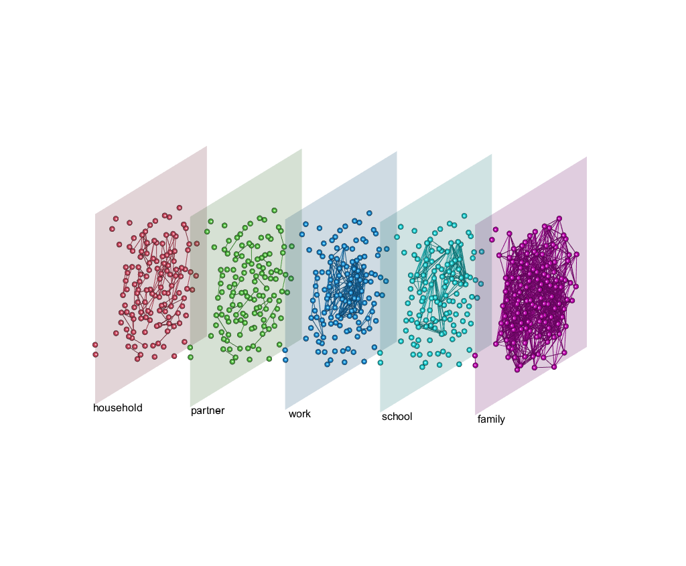

```{r setup, include=FALSE}
knitr::opts_chunk$set(echo = TRUE)

library(here)
library(tidyverse)
library(muxViz)
library(ggplot2)
library(igraph)
library(Matrix)
library(rgl)      # output 3d plots
library(tidytext) # ordering factors within facets
library(ggsankey) # sankey diagrams
library(patchwork)
```

# Data prep

```{r}
nodes <- read.csv(here("dummy_data/popnet_nodelist.csv"))
edges <- read.csv(here("dummy_data/popnet_edgelist.csv"))
```

```{r}
# types of edges
edges %>% 
  count(edgetype) %>% 
  arrange(desc(n))

# number of nodes
length(unique(c(edges$source, edges$target)))

# missing nodes
nodes[!nodes$node_id %in%  unique(c(edges$source, edges$target)),]
```

**Network sampling**

Example code if sampling is necessary.

```{r, eval = FALSE}
child_edges <- edges[edges$edgetype == "child",]

child_nodes <-  child_edges["source"]

keep_relations <- c("child", "parent", "sibling")

# sampling, e.g., 30% of children
sample_frac <- 0.3
pop_size <- nrow(child_nodes)

set.seed(789)
child_sample_idx <- sample(x = 1:pop_size, size = sample_frac * pop_size, replace = FALSE)

child_sample_ids <- child_nodes[child_sample_idx,]

# subset edge data to sampled children in specified relations
egdes_sample <- edges[(edges$source %in% child_sample_ids | edges$target %in% child_sample_ids) &
                        (edges$edgetype %in% keep_relations),]
```

Here, proceed with full data set.

```{r}
# Make single-layer network
g_all <- graph_from_data_frame(d = edges[, c("source", "target")],
                               vertices = nodes$node_id)
```

```{r}
# Make multi-layer network
groups <- unique(edges$edgetype)
layers <- 4 # (after collapsing family categories)
obs <- nrow(nodes)

node_tensor <- list()
g_list <- list()

for (g in groups) {
  graph <- graph_from_data_frame(d = edges[edges$edgetype == g, c("source", "target")],
                                 # include ALL vertices
                                 vertices = nodes$node_id)
  g_list[[g]] <- graph
  node_tensor[[g]] <- as_adjacency_matrix(graph)
}


# collapse corresponding categories into "family"
family <-  c('aunt / uncle', 'neighbor', 'cousin', 'mother / father-in-law', 'sibling',  'grandchild', 'grandparent',  'niece / nephew', 'parent', 'sister / brother-in-law',  'child', 'daughter / son-in-law', 'partner')

graph_fam <- graph_from_data_frame(d = edges[edges$edgetype %in% family, c("source", "target")],
                                   # include ALL vertices
                                   vertices = nodes$node_id)
g_list[["family"]] <- graph_fam
node_tensor[["family"]] <- as_adjacency_matrix(graph_fam)

# remove subcategories of family from graph
g_list <- g_list[!names(g_list) %in% family]
node_tensor <- node_tensor[!names(node_tensor) %in% family]

# Define layer tensor
layer_tensor <- Matrix(c(0,1,1,1,
                         1,0,1,1,
                         1,1,0,1,
                         1,1,1,0) , nrow = 4, sparse = TRUE)

# Build supra-adjacency matrix
M <- BuildSupraAdjacencyMatrixFromEdgeColoredMatrices(node_tensor, layer_tensor, layers, obs)
```

# Explore multi-layer network

```{r, fig.height=7, fig.width=7}
#rotate <- function(mat) t(mat[nrow(mat):1, ,drop = FALSE])

#M_flip <- rotate(as.matrix(M))

# image(t(M_flip),
#       axes = FALSE)

heatmap(as.matrix(M), Rowv = NA, Colv = NA, useRaster = TRUE,
        col = hcl.colors(100), revC = TRUE,
        labRow = rep(1:nrow(nodes), layers), labCol = rep(1:nrow(nodes), layers))
```

```{r}
set.seed(789)
lay <- layoutMultiplex(g_list, layout = "comp", box = TRUE)

plot_multiplex3D(g_list,
  layer.layout = lay, layer.colors = c(2:5),
  layer.shift.x = 0.3, layer.space = 2,
  layer.scale = 2.2, layer.alpha = rep(.2, length(g_list)),
  layer.labels = names(g_list), layer.labels.cex = 1,
  node.size.values = 6,
  FOV = 0
)

snapshot3d("3dplot_dummy.png", fmt = "png", width = 1024, height = 1024)


```

# Explore multi vs. single-layer centralities

```{r, fig.width=4, fig.height=5, warning=FALSE}
plot_centrality_ranking <- function(type, single, multi, node_ids, yaxis_title = TRUE) {
  
  df <- data.frame("single" = single, "multi" = multi) %>% 
    mutate(id = as.factor(node_ids)) %>% 
    pivot_longer(cols = -id, names_to = "layers", values_to = type) %>% 
    group_by(layers) %>% 
    mutate(rank = rank(desc(.data[[type]]), ties.method = "min")) %>% 
    ungroup()
  
  top20_dat <- df %>% 
    arrange(layers, rank) %>% 
    group_by(layers) %>% 
    mutate(top20 = ifelse(row_number() %in% c(1:20), as.character(id), NA)) %>% 
    ungroup() %>% 
    mutate(top20 = ifelse(id %in% top20, TRUE, NA)) %>% 
    filter(top20 == TRUE) %>% 
    select(-.data[[type]]) %>% 
    pivot_wider(values_from = c("rank"), names_from = layers)

  sankey_dat <- top20_dat %>% 
    make_long("single", "multi")
  
  ggplot(sankey_dat, aes(x = x, next_x = next_x, node = node, next_node = next_node,
                         fill = node/max(df$rank)*100, label = node)) +
    geom_sankey(flow.alpha = .6, space = 1.5, width = 0.15) +
    geom_sankey_label(size = 2.2, color = "black", fill = "white", space = 1.5, alpha = 0.8) +
    theme_sankey() +
    scale_fill_viridis_c(option = "plasma") +
    scale_x_discrete(labels = c("single" = "Single-layer", "multi" = "Multi-layer")) +
    labs(x = NULL, fill = "Node rank (%)", title = type) +
    list(if(yaxis_title){labs(y =  "Node rank (absolute)")} else {labs(y = NULL)}) +
    coord_cartesian(xlim = c(1.4, 2)) +
    guides(fill = guide_colorbar(title.hjust = 0.5)) +
    theme(legend.position = c(.87, .5),
          plot.title = element_text(hjust = 0.34, margin = margin(b = -10)))
}

# Degree
deg_single <- degree(g_all)
deg_mult <- c(GetMultiDegreeSum(M, layers, obs, isDirected = FALSE))

plt_deg <- plot_centrality_ranking("Degree centrality", deg_single, deg_mult, nodes$node_id)

# Eigenvector
eig_single <- eigen_centrality(g_all)$vector
eig_mult <- c(GetMultiEigenvectorCentrality(M, layers, obs))

plt_eig <- plot_centrality_ranking("Eigenvector centrality", eig_single, eig_mult, nodes$node_id, yaxis_title = FALSE)

# k-core
# deg_single <- degree(g_all)
# deg_mult <- c(GetMultiDegree(M, layers, obs, isDirected = F))
# 
# plot_centrality_ranking("degree", deg_single, deg_mult, nodes$node_id)

# PageRank
pr_single <- page_rank(g_all)$vector
pr_mult <- c(GetMultiPageRankCentrality(M, layers, obs))

plt_pr <- plot_centrality_ranking("PageRank centrality", pr_single, pr_mult, nodes$node_id)

# Closeness
clo_single <- closeness(g_all)
clo_mult <- GetMultiClosenessCentrality(M, layers, obs)[[1]]

plt_clo <- plot_centrality_ranking("Closeness centrality", clo_single, clo_mult, nodes$node_id, yaxis_title = FALSE)
```


```{r, fig.width=8, fig.height=10, warning=FALSE}
(plt_deg + plt_eig) /
  (plt_pr + plt_clo)

ggsave(here("analyses/sankeyplot_all.png"), dpi = 600,
       width = 8.2, height = 10)
```


```{r, fig.width=8, fig.height=5, warning=FALSE}
plt_eig <- plot_centrality_ranking("Eigenvector centrality", eig_single, eig_mult, nodes$node_id)
plt_pr <- plot_centrality_ranking("PageRank centrality", pr_single, pr_mult, nodes$node_id, yaxis_title = FALSE)

plt_eig + plt_pr

ggsave(here("analyses/sankeyplot_eig-pr.png"), dpi = 600,
       width = 8.2, height = 5)
```

