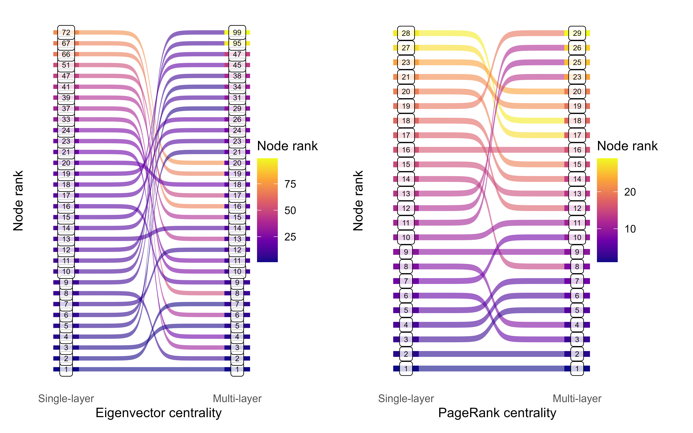

class: center, middle, inverse

```{r setup, include=FALSE}
options(htmltools.dir.version = FALSE)
```

# Let's break it down:

---
class: center, middle, inverse

# **Predicting Covid-19 outbreaks** <span style = "color:gray";> using multi-layer centrality measures </span>

---
class: left, top

## ***The relevance of my project***

*Image/text related to Covid modeling*

---
class: center, middle, inverse

# <span style = "color:gray";> Predicting Covid-19 outbreaks using </span> **multi-layer** <span style = "color:gray";> centrality measures </span>

---
class: left, top

## ***The methodological framework: Multi-layer networks***


---
class: center, middle, inverse

# <span style = "color:gray";> Predicting Covid-19 outbreaks using multi-layer  </span> **centrality measures**

---
class: left, top

## ***The prediction method: Centrality measures***

*Image related to centrality*

---
class: center, middle, inverse

# Single-layer centrality **!=** Multi-layer centrality 

---
class: left, top

*Images of collapsed and uncollapsed multi-layer, highlight central node*

---
class: center, middle, inverse

# **Preliminary Results**

---
class: center

### *Ranking nodes: Single-layer vs. Multi-layer centrality*


