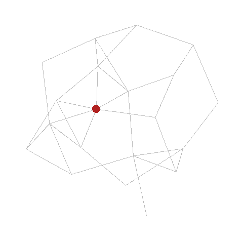
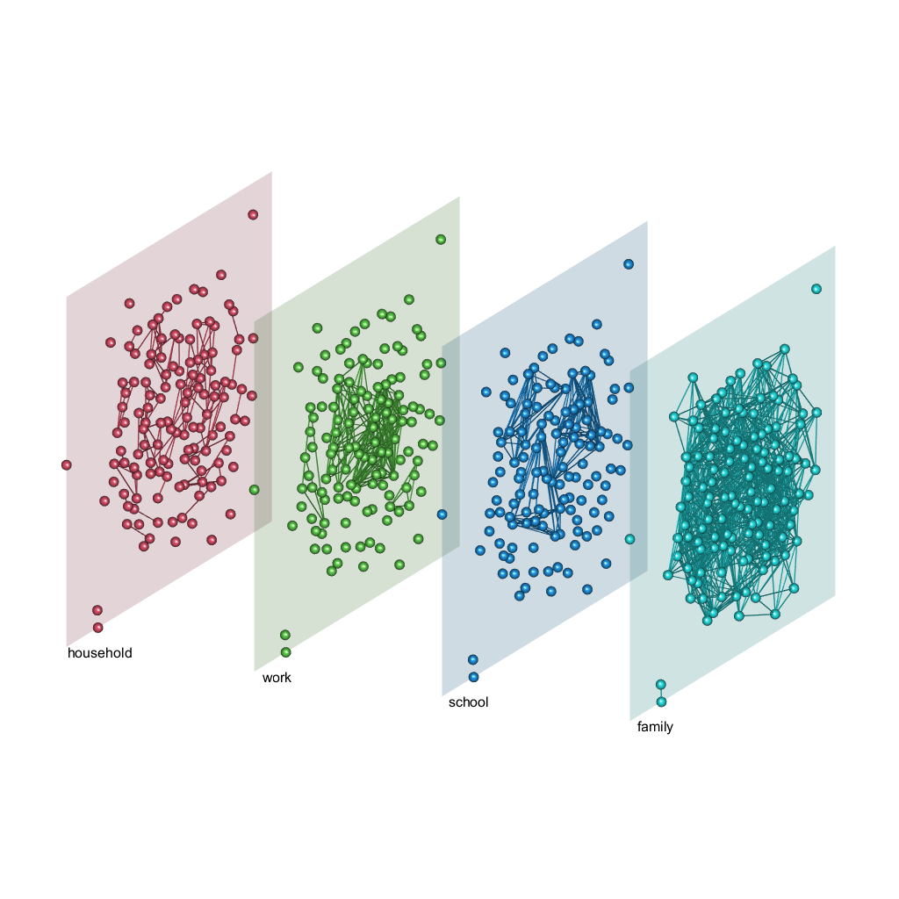
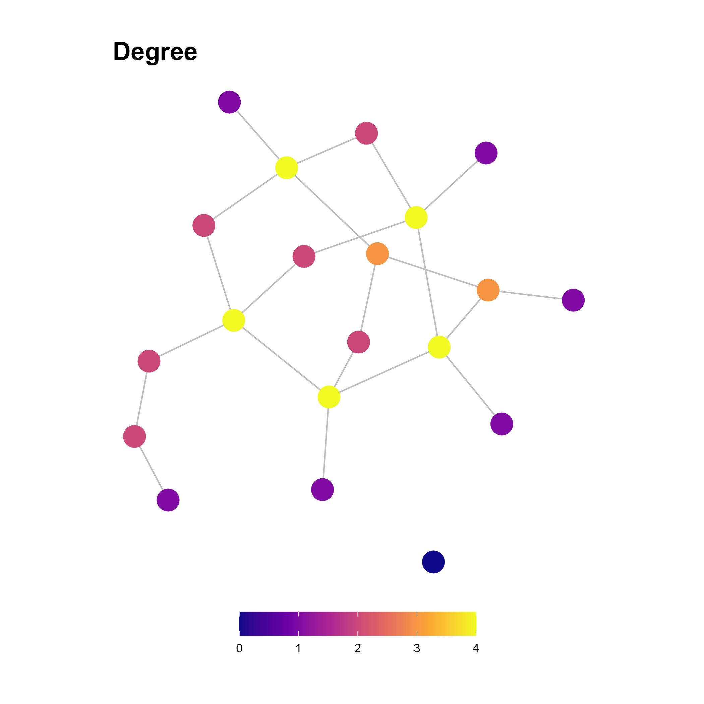
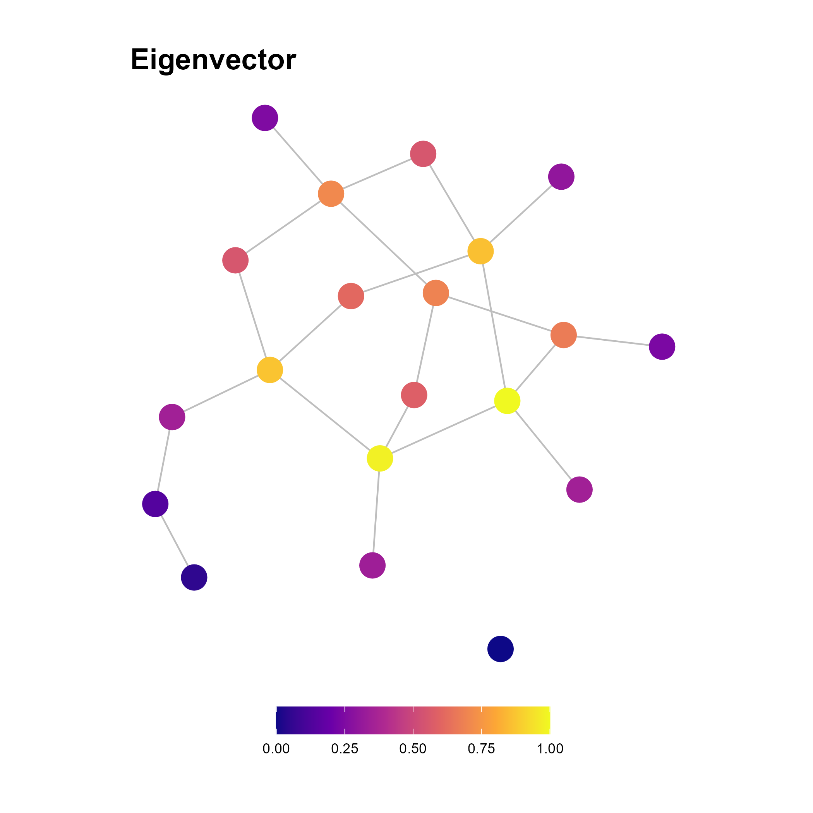
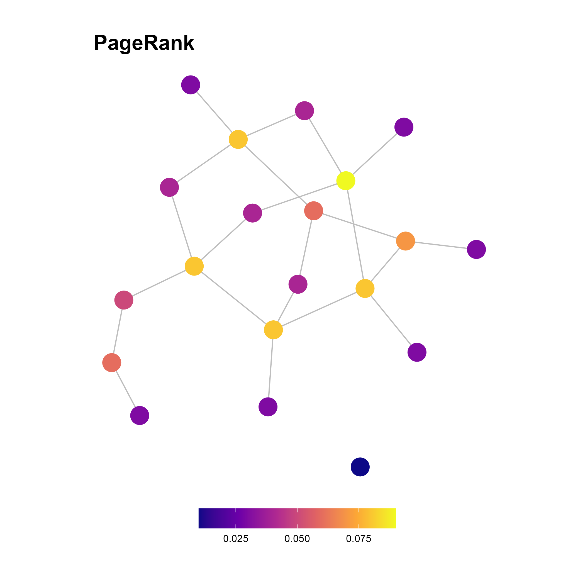
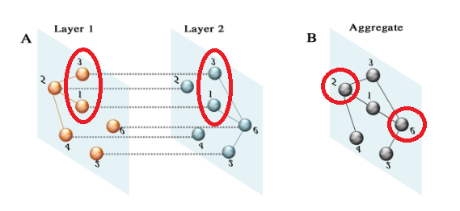

class: center, middle, inverse

```{r setup, include=FALSE}
options(htmltools.dir.version = FALSE)

knitr::opts_chunk$set(echo = FALSE,
                      message = FALSE)

library(igraph)
library(tidygraph)
library(ggraph)
library(gganimate)
```


# **Predicting Covid-19 infections** <span style = "color:darkslategray";> using multi-layer centrality measures </span>

---
class: middle

.pull-left[.center[
```{r, out.width="100%"}
# make sample graph
set.seed(789)
g <- sample_gnm(n = 20, m = 35)
#plot(g)

# order nodes by degree
g <- permute(g, Matrix::invPerm(order(degree(g), decreasing = TRUE)))
V(g)$names <- 1:20

# assign time of infection to nodes
V(g)$inf_time <- c(1,2,2,4,3,5,3,5,3,3,5,4,5,6,6,3,7,5,7,8)  

if (!file.exists("img/net_animation.gif")) {
  # make animated plot
  p <- ggraph(g, layout = "stress") +
    geom_edge_link(color = "gray") +
    geom_node_point(aes(group = inf_time),
                    color = "firebrick", size = 7) +
    theme_graph(background = "transparent") +
    coord_fixed() +
    theme(rect =  element_rect(fill = "transparent")) +
    transition_time(inf_time) +
    enter_fade() +
    shadow_mark()
    
  anim_save("img/net_animation.gif", bg = 'transparent', p)
}


```
]]

### <p style="margin:250px 0px 0px 550px"> Model spread to inform policy decisions! <br><br> <b>Who</b> gets infected and <b>when</b>?
</p>


---
class: center, middle, inverse

# <span style = "color:darkslategray";> Predicting Covid-19 infections using </span> **multi-layer** <span style = "color:darkslategray";> centrality measures </span>

---
class: left, top

### Our lives are multi-layered.



<p style="margin:-400px 0px 0px 800px"> 
<b> CBS micro-data </b> allows to construct multi-layer network dataset. <br><br> 
Micro-data can be linked to <b> PCR test data. </b> <br><br> 
Analyses conducted on regional <b> subset</b> of ~ 1m nodes.
</p>

---
class: center, middle, inverse

# <span style = "color:darkslategray";> Predicting Covid-19 infections using multi-layer  </span> **centrality measures**

---
class: left, top

```{r}
set.seed(777)
g2 <- sample_gnp(n = 20, p = 0.1)
# g2 <- sample_smallworld(dim = 1, size = 7, nei = 2, p = 0.5)
# g2 <- sample_pa(n = 10, power = 1, m = 3, directed = FALSE)
# plot(g2, layout = layout_with_fr)

g2 <- as_tbl_graph(g2) %N>% 
  mutate(Degree = centrality_degree(),                       
         Eigenvector = round(centrality_eigen(), 2),
         PageRank = round(centrality_pagerank(), 2),
         Betweenness = round(centrality_betweenness(), 2),
         Closeness = round(centrality_closeness(normalized = TRUE), 2)) 

set.seed(777)
lay <- layout_with_fr(g2)

cent_plots <- list()

for (c in colnames(as_tibble(g2))) {
  
  if (!file.exists(paste0("img/", c, ".png"))) {
    
    cent_plots[[c]] <- g2 %>% 
    ggraph(layout = lay) +
    geom_edge_link(color = "gray") +
    geom_node_point(aes(color = .data[[c]]),
                    size = 7) +
    scale_color_viridis_c(option = "plasma") +
    theme_graph(background = "transparent") +
    coord_fixed() +
    ggtitle(c) +
    theme(rect =  element_rect(fill = "transparent"), 
          legend.position = "bottom",
          legend.title = element_blank(), legend.key.width = unit(1.2, "cm"))
    
    ggsave(paste0("img/", c, ".png"), bg = 'transparent', plot = cent_plots[[c]])
  }
}
```
<br>


--


--



---
class: center, middle, inverse

# **Single-layer centrality <br> &#8800; <br> Multi-layer centrality **

---
class: left, middle

<figure>

<figcaption style="font-size:15px; margin:0px 0px -10px 150px"> <i>De Domenico et al. 2015, Supplementary Figure 1</i> </figcaption> 
</figure>

<br><br>

----

<p style="font-size:15px">De Domenico, M., Solé-Ribalta, A., Omodei, E., Gómez, S., & Arenas, A. (2015). Ranking in interconnected multilayer networks reveals versatile nodes. Nature Communications, 6(1), 6868. https://doi.org/10.1038/ncomms7868 </p>


---
class: left, top, inverse

## **Bringing it all together:**

<br><br><br>

> ## How well can multi-layer centrality measures predict the infection of individuals with epidemic diseases like Covid-19?

---
class: center, middle, inverse

# **Analytic Strategy**

---
class: left, top

###  *Outcome*: **Time until infection**

### *Predictors*: Degree, Eigenvector, PageRank<br>
-----------------------------------------------------
--

1. ### Simulate an epidemic on the network k = 500 
--

2. ### Get time until infection for the nodes in each simulation
--

3. ### Run prediction models for each of the 500 data sets and compute estimates
--
  
  #### a. Rank correlations $\rho$ of centrality measures and outcome
--

  #### b. Uno's Concordance Index $C$ of Cox models including linear combinations of centralities as predictors
--

  #### c. $R^2$ of linear models including linear combinations of centralities as predictors
--

4. ### Average the estimates across simulations


---
class: center, middle, inverse

# **Results** 
---
class: left, top
<br><br>

### a. **Medium negative correlations** of all centrality measures with outcome <br>
--

### b. **Concordance index ~ 0.85** for predictor combinations including Degree centrality and/or PageRank <br>
--

### c. ~ **15% of variance** explained in outcome by (at least) Degree $^2$ <br>
--
<br>

###  **Also**: Only small differences between single-layer and multi-layer measures.


---
class: center, middle, inverse

# **Is that it?**

---
class: left, top
<br><br>

## Multiple layers, multiple transmission rates.
--
<b>

### **&#10132;** **Weighted Degree centrality**
--

<br><br>

### ...minimal performance increase

---
class: center, top, inverse
<br><br><br><br><br><br><br>

# **...what about the real infection data?**

---
class: center, top, inverse
<br><br><br><br><br><br><br>

# **<span style = "color:darkslategray";> ...what about the real infection data? </span>**

### $$R^2 \le 0.01$$

---
class: center, middle, inverse

# **Lessons learned**

---
class: left, top, clear
<br>

> ### Centrality measures can predict **relative infection risks** well, but are limited in predicting the **timing of infections**.
--
<br><br>
> ### Multi-layer measures don't seem to offer great benefits.
--
<br><br>
> ### Administrative data is not sufficient to model social contacts.

---
class: left, top, clear
<br>

> ### <span style = "color:lightgray";>Centrality measures can predict relative infection risks well, but are limited in predicting the timing of infections.</span>
<br>
> ### <span style = "color:lightgray";>Multi-layer measures don't seem to offer great benefits.</span>
<br>
> ### <span style = "color:lightgray";>Administrative data is not sufficient to model social contacts.</span>

<br>
### &nbsp; &nbsp; &nbsp; Centrality measures could still **complement** prediction models
--

 ### &nbsp; &nbsp; &nbsp; ... **if** used with representative contact networks.

---
class: center, middle, inverse

# **Backup slides**

---
class: left, top

#### Behind the scenes: **Simulating an epidemic** on a large-scale network using a SIR model.

$$\frac{dS}{dt} = -\beta I S$$

$$\frac{dI}{dt} = \beta I S - \gamma I$$

$$\frac{dR}{dt} = \gamma I$$

#### Each node can be in one of the **three states**, and **transitions stochastically** based on *network contacts*, *transmission rate*, and *recovery time*.

$$S \rightarrow I$$
$$I \rightarrow R$$

#### Where the transmission probabilities for the nodes in layer $l$ at time $t$ is given by:

$$\pmb{\tau'}_{lt} = 1 - (1 - \tau_l)^\mathbf{\Gamma_{t-1}}$$

---
class: left

# Do you have...


### 👩👴👶👦...many close relatives? (Degree Centrality) <br>

### 👩👴👶👦 👭 👧👴👵👦...many close relatives and also a partner with a big family? (Eigenvector Centrality)<br>

### ✈️🌍 👧👴👵👦... but that partner's family lives in a different country? (Betweenness Centrality) <br>

<br>

###... then you could be a **super-spreader**.
<br>

### High centrality **&#8669;** High spreading capacity

### &nbsp;&nbsp;&nbsp; ***But***: High spreading capacity **&#8800;** High infection risk


<!-- to build incremental slides as separate pages in PDF -->
```{css, echo=FALSE}
@media print {
  .has-continuation {
    display: block;
  }
}
```